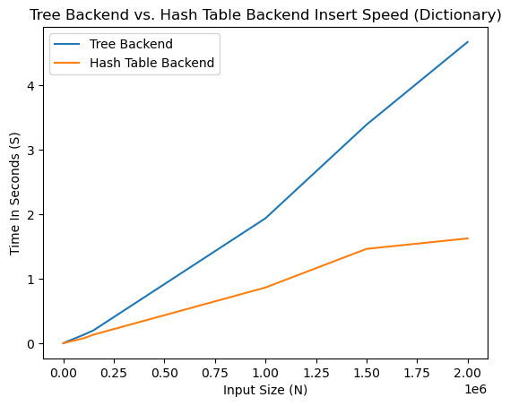

# Hypothesis

I predict that the multimap will be slower than the unordered multimap. This is due to the fact that the multimap has a balanced tree as the backend for the dictionary implementation, which is O(log(n)) insertion time. The unordered multimap has a hashtable as the backend for the dictionary implementation with O(1) runtime, so it should be factors faster than the multimap. I'm not sure what the factor is, but I will guess that the unordered multimap is at least 2 times faster than the multimap. In addition, I predict that it will take a while for the runtime of the unordered multimap to overtake the runtime of the multimap. This is because the two will have similar speed for smaller input sizes, but once the input size is big enough, the unordered multimap should be much faster. I think the multimap might be faster for smaller input sizes, but that is just a guess. 

# Methods

I started the process by creating two functions, one that would insert n elements into a multimap and another that would do the same thing for an unordered multimap. After that, I created a vector to store the input sizes that I was planning on testing. For the input sizes 10 and 100, I had to estimate their run times from the input size 10000. After the creation of the input sizes vector, I wrote a loop that would go through each input size and time how long it takes to insert the input size amount of elements into a multimap and an unordered multimap. After each of these times were calculated, I appened them to their respective vector that stored the runtimes for the multimap or the unordered multimap. For each iteration of the loop, I also reinstantiated both the multimap and the unordered  multimap, this way it was truly just an insertion of n elements starting from an empty dictionary. After all the times were calculated, I outputted them to the console alongside the input size that was passed to each dictionary implementation. The specifics of the input sizes I chose and other details are available in my code below. 

    #include <iostream>
    #include <vector>
    #include <map>
    #include <unordered_map>
    #include <cstdlib>
    #include <ctime>
    
    void insert_multimap(std::multimap<int, int>& map, int n)
    {
        for (int i = 0; i < n; i++)
        {
            int rand_int1 = rand() % 10000;
            int rand_int2 = rand() % 10000;
            map.insert(std::pair<int, int>(rand_int1, rand_int2));
        }
    }
    
    void insert_unordered_multimap(std::unordered_multimap<int, int>& map, int n)
    {
        for (int i = 0; i < n; i++)
        {
            int rand_int1 = rand() % 10000;
            int rand_int2 = rand() % 10000;
            map.insert(std::pair<int, int>(rand_int1, rand_int2));
        }
    }
    
    int main()
    {
        std::vector<int> input_sizes {1000, 5000, 10000, 15000, 100000, 150000, 1000000, 1500000, 2000000};
        double one_second_tree = 0.0000011;
        double one_second_hash = 0.0000006;
        std::vector<double> times_tree {one_second_tree * 10, one_second_tree * 100};
        std::vector<double> times_hash {one_second_hash * 10, one_second_hash * 100};
        for (auto size: input_sizes)
        {
            std::multimap<int, int> map_tree;
            std::unordered_multimap<int, int> map_hash;
            std::clock_t start_time_tree = std::clock();
            insert_multimap(map_tree, size);
            std::clock_t tot_time_tree = std::clock() - start_time_tree;
            double time_tree = ((double) tot_time_tree) / (double) CLOCKS_PER_SEC;
            times_tree.push_back(time_tree);
            std::clock_t start_time_hash = std::clock();
            insert_unordered_multimap(map_hash, size);
            std::clock_t tot_time_hash = std::clock() - start_time_hash;
            double time_hash = ((double) tot_time_hash) / (double) CLOCKS_PER_SEC;
            times_hash.push_back(time_hash);
        }
  
        input_sizes.insert(input_sizes.begin(), 100);
        input_sizes.insert(input_sizes.begin(), 10);
        for (int i = 0; i < times_tree.size(); i ++)
        {
            std::cout << "Input Size: " << input_sizes[i] << std::endl;
            std::cout << "Time Multimap: " << times_tree[i] << " Seconds" << std::endl;
            std::cout << "Time Unordered Multimap: " << times_hash[i] << " Seconds" << std::endl;
            std::cout << std::endl;
        }
    }
    
# Results

Here is the output of the code above:

    Input Size: 10
    Time Multimap: 1.1e-05 Seconds
    Time Unordered Multimap: 6e-06 Seconds
    
    Input Size: 100
    Time Multimap: 0.00011 Seconds
    Time Unordered Multimap: 6e-05 Seconds
    
    Input Size: 1000
    Time Multimap: 0.001 Seconds
    Time Unordered Multimap: 0.001 Seconds
    
    Input Size: 5000
    Time Multimap: 0.005 Seconds
    Time Unordered Multimap: 0.005 Seconds
    
    Input Size: 10000
    Time Multimap: 0.014 Seconds
    Time Unordered Multimap: 0.008 Seconds
    
    Input Size: 15000
    Time Multimap: 0.021 Seconds
    Time Unordered Multimap: 0.012 Seconds
    
    Input Size: 100000
    Time Multimap: 0.13 Seconds
    Time Unordered Multimap: 0.076 Seconds
    
    Input Size: 150000
    Time Multimap: 0.201 Seconds
    Time Unordered Multimap: 0.133 Seconds
    
    Input Size: 1000000
    Time Multimap: 1.936 Seconds
    Time Unordered Multimap: 0.863 Seconds
    
    Input Size: 1500000
    Time Multimap: 3.387 Seconds
    Time Unordered Multimap: 1.462 Seconds
    
    Input Size: 2000000
    Time Multimap: 4.668 Seconds
    Time Unordered Multimap: 1.624 Seconds

This graph shows the input size on the X axis and the time in seconds it took for the inserting of the input size of elements into a Tree Backend and a Hash Table Backend. As we can see from this graph, it shows that the multimap (Tree Backend) grows much faster than the unordered multimap (Hash Table Backend) when the input size increases. It seems for smaller sizes all the way up to two hundred thousand, the runtime of the multimap and the unordered multimap is close to the same, but once the input size surpasses two hundred thousand, it is clear that the unordered multimap is much faster than the multimap. 

# Discussion

The data that I collected is a bit sparse, but I used input sizes between 10 and 2,000,000 that I believed were significant thresholds for runtime testing. I could collect more data in between the input sizes I chose and create a smoother graph, but I believe that the shape of the graph is representative of the runtime differences even with only the sparse points I collected. When it comes to the results, I was actually surprised that the runtimes remained comparable for so long. I expected the unordered multimap to be much faster than the multimap by an input size of 10,000, but I was obviously wrong. During the collection of my data, I had a bug where the dictionary that I passed into the functions that inserted the elements wasn't being updated with the values inserted. This was a rookie mistake on my end and the fix was changing the type of the function parameter to a reference. 

# Conclusions

With my local settings and the input sizes I chose, it seems like using an unordered multimap is noticeably faster than a multimap when the input size is over 100,000 elements. Also, in general, for larger input sizes, an unordered multimap is more than 2 times faster than a multimap. 
