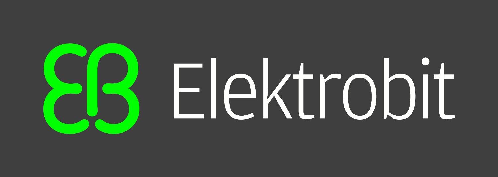

  

  
  

  

<h1>
  Hi, My Name Is Nathan and Welcome to My Github Profile!
  
</h1>

### :computer: About Me :
- I am currently a Senior at Michigan State University studying Computer Science with a minor in Data Science :man_student:
- Graduating December 2023 Fall :school:
- I am interested in ML/AI, Algorithm Engineering, and Quantitative Developer :necktie:
- I am planning on pursuing my Masters after I graduate, hopefully during full-time employment
- I enjoy collecting Pokemon Cards in my free time :star:
- My resume is available here: <a href="Resume_2023.pdf"> Resume </a>

---

  
  
  

  

  
### :office_worker: Companies I Have Worked For:
- Elektrobit
- Carpenter Technology Corporation
- Michigan State University

---

### :toolbox: Languages and Tools:

  &nbsp;
  &nbsp;
  &nbsp;
  &nbsp;
  &nbsp;
  &nbsp;
  &nbsp;
  &nbsp;
  

---

### Github Stats

---
### How To Contact Me:
- Email: nategu2012@gmail.com
- School Email: gunathan@msu.edu
